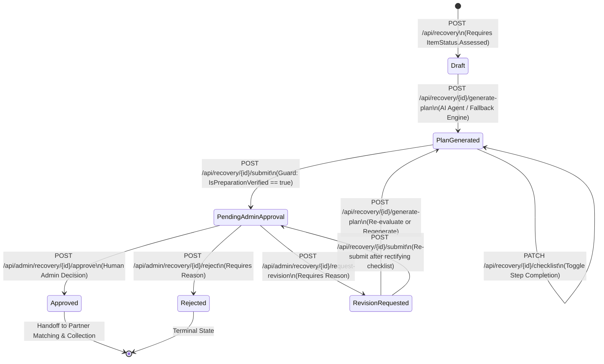
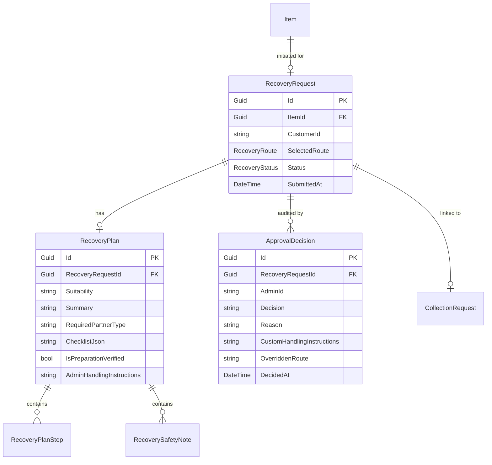

# Recovery Status Lifecycle Documentation

**Component:** Component B — Recovery & Recovery Planning Agent  
**Module Owner:** Member 2 (`docs/members/member-2/`)  
**Domain Enum:** `LoopWorth.Domain.Enums.RecoveryStatus`  
**Associated Entities:** `RecoveryRequest`, `RecoveryPlan`, `ApprovalDecision`, `ItemAssessment`, `Item`  

---

## 1. Overview of Recovery States

The recovery lifecycle governs the operational and safety states of an electronic item after condition assessment until it is approved for logistics fulfillment or rejected. 

The domain defines six explicit states in `RecoveryStatus`:

```csharp
namespace LoopWorth.Domain.Enums;

public enum RecoveryStatus
{
    Draft,
    PlanGenerated,
    PendingAdminApproval,
    Approved,
    Rejected,
    RevisionRequested
}
```

---

## 2. State Descriptions

| Status | Code Value | Phase | Description |
| :--- | :---: | :--- | :--- |
| **`Draft`** | `0` | Initiation | The recovery request has been created following item assessment, but no AI recovery plan has been generated yet. |
| **`PlanGenerated`** | `1` | Preparation | The Recovery Planning Agent (or fallback engine) has formulated tailored preparation steps, safety notes, and a pre-collection checklist. Customer is reviewing guidelines and completing mandatory checklist tasks. |
| **`PendingAdminApproval`** | `2` | Governance | The customer has completed all mandatory preparation items and submitted the request. It is locked from customer edits and queued for human administrative review. |
| **`Approved`** | `3` | Completion / Handoff | A human administrator reviewed and authorized the plan. The item is unlocked for partner matching (Component C) and collection logistics (Component D). |
| **`Rejected`** | `4` | Terminal | A human administrator rejected the recovery request with a mandatory documented reason. The item cannot proceed further under this recovery cycle. |
| **`RevisionRequested`** | `5` | Iteration | An administrator identified defects in the plan or preparation (e.g. need for better packaging, route reassessment) and returned it with mandatory notes. The customer can regenerate the plan or rectify checklist items. |

---

## 3. Mermaid State Transition Diagram



---

## 4. Transition Rules and Triggers

### 1. `[*] -> Draft`
* **Trigger:** Calling `POST /api/recovery` with valid `itemId`.
* **Guard Conditions:**
  * User is authenticated as a customer.
  * Item exists and belongs to the authenticated customer.
  * `item.Status == ItemStatus.Assessed`.
  * `item.SelectedRecoveryRoute != null`.
  * No active recovery request already exists for the item (`r.ItemId == itemId && r.Status != RecoveryStatus.Rejected`).
* **Side Effects:** A new `RecoveryRequest` record is persisted with status `Draft`.

### 2. `Draft -> PlanGenerated`
* **Trigger:** Calling `POST /api/recovery/{id}/plan` or `POST /api/recovery/{id}/generate-plan`.
* **Guard Conditions:** Caller is the request owner or an Admin; status must be `Draft`, `PlanGenerated`, or `RevisionRequested`.
* **Side Effects:** 
  * Invokes `IRecoveryPlanningAgent.GeneratePlanAsync()`.
  * Removes any previous `RecoveryPlan` on this request.
  * Adds new `RecoveryPlan`, `RecoveryPlanStep`, and `RecoverySafetyNote` entities.
  * Serializes tailored checklist to `RecoveryPlan.ChecklistJson`.
  * Sets `RecoveryPlan.IsPreparationVerified = false`.
  * Sets `recovery.Status = RecoveryStatus.PlanGenerated`.

### 3. `PlanGenerated -> PendingAdminApproval`
* **Trigger:** Calling `POST /api/recovery/{id}/submit`.
* **Guard Conditions:**
  * Caller is the request owner.
  * Request has a generated plan.
  * **Critical Safety Guard:** `recovery.Plan.IsPreparationVerified` must be `true` (all mandatory checklist steps marked complete via `PATCH /api/recovery/{id}/checklist`).
* **Side Effects:** Sets `SubmittedAt = DateTime.UtcNow` and `recovery.Status = RecoveryStatus.PendingAdminApproval`.

### 4. `PendingAdminApproval -> Approved`
* **Trigger:** Calling `POST /api/admin/recovery/{id}/approve` or `POST /api/admin/recovery/{id}/decision` (`decision = "Approved"`).
* **Guard Conditions:** Caller must possess the `Admin` role; request status must be `PendingAdminApproval`.
* **Side Effects:**
  * Persists an `ApprovalDecision` record with `Decision = "Approved"`.
  * Optionally saves `CustomHandlingInstructions` to `RecoveryPlan.AdminHandlingInstructions`.
  * Optionally overrides `recovery.SelectedRoute` and `item.SelectedRecoveryRoute`.
  * Updates `AgentWorkflow.CurrentStage = "AdminApproved"`.
  * Sets `recovery.Status = RecoveryStatus.Approved`.

### 5. `PendingAdminApproval -> Rejected`
* **Trigger:** Calling `POST /api/admin/recovery/{id}/reject` or `POST /api/admin/recovery/{id}/decision` (`decision = "Rejected"`).
* **Guard Conditions:** Caller must possess the `Admin` role; non-empty `Reason` string is required.
* **Side Effects:**
  * Persists an `ApprovalDecision` record with `Decision = "Rejected"` and the reason.
  * Sets `recovery.Status = RecoveryStatus.Rejected`.
  * Serves as a terminal state for this request.

### 6. `PendingAdminApproval -> RevisionRequested`
* **Trigger:** Calling `POST /api/admin/recovery/{id}/request-revision` or `POST /api/admin/recovery/{id}/decision` (`decision = "RevisionRequested"`).
* **Guard Conditions:** Caller must possess the `Admin` role; non-empty `Reason` string is required.
* **Side Effects:**
  * Persists an `ApprovalDecision` record capturing the required adjustments.
  * Sets `recovery.Status = RecoveryStatus.RevisionRequested`.

### 7. `RevisionRequested -> PlanGenerated` or `PendingAdminApproval`
* **Trigger:** 
  * The customer can trigger plan regeneration (`POST /api/recovery/{id}/generate-plan`), returning to `PlanGenerated`.
  * Alternatively, the customer can toggle checklist items (`PATCH /api/recovery/{id}/checklist`) and re-submit (`POST /api/recovery/{id}/submit`), moving back to `PendingAdminApproval`.

---

## 5. Invalid / Unsupported Transitions

The following transitions are strictly forbidden and blocked by the controller:

1. **`Draft -> PendingAdminApproval`:**
   * Blocked: A plan must be generated before submission (`recovery.Status != RecoveryStatus.PlanGenerated && recovery.Status != RecoveryStatus.RevisionRequested` returns HTTP 400).
2. **`PlanGenerated (Unverified) -> PendingAdminApproval`:**
   * Blocked: If `recovery.Plan.IsPreparationVerified == false`, `Submit()` returns HTTP 400 with `requiresChecklistCompletion: true`.
3. **`Draft -> Approved` (Direct Admin Bypass):**
   * Blocked: `MakeDecision()` asserts `recovery.Status == RecoveryStatus.PendingAdminApproval`; otherwise returns HTTP 400.
4. **`Approved -> Draft` or `Rejected -> Approved`:**
   * Blocked: No transition endpoint exists from terminal or finalized states back to initial draft states.
5. **Duplicate Active Creation for Same Item:**
   * Blocked: `POST /api/recovery` checks `AnyAsync(r => r.ItemId == dto.ItemId && r.Status != RecoveryStatus.Rejected)` and returns HTTP 409 Conflict.

---

## 6. Entity Relationships in the Lifecycle


