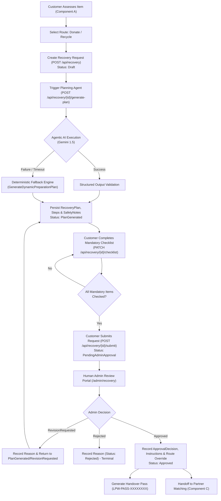

# Recovery Workflow Documentation

**Component:** Component B — Recovery & Recovery Planning Agent  
**Module Owner:** Member 2 (`docs/members/member-2/`)  
**Backend Namespace:** `LoopWorth.Domain.Entities`, `LoopWorth.Api.Controllers`, `LoopWorth.Infrastructure.Agents`  
**Frontend Modules:** `frontend/src/modules/recovery/`, `mobile/lib/features/recovery/`  

---

## 1. Overview and High-Level Architecture

The **Recovery** component serves as the central transition pipeline connecting initial item condition assessment (Component A) to partner allocation (Component C) and collection logistics (Component D). It ensures that no electronic device moves toward donation or recycling without a device-specific preparation plan, verified user safety compliance, and human administrative review.



---

## 2. Request Initiation & Preconditions

A recovery request begins once an item has completed initial assessment.

### Preconditions for Creation (`RecoveryController.Create`)
1. **Authentication:** The caller must possess a valid authenticated customer JWT (`[Authorize]`).
2. **Item Existence:** The specified `itemId` must exist in `_context.Items`.
3. **Item Ownership:** The item's `CustomerId` must match the authenticated `User.FindFirstValue(ClaimTypes.NameIdentifier)`.
4. **Assessment Requirement:** `item.Status` must equal `ItemStatus.Assessed`.
5. **Route Selection:** `item.SelectedRecoveryRoute` must not be null (either `RecoveryRoute.Donate` or `RecoveryRoute.Recycle`).
6. **Active Request Uniqueness:** There must be no existing active recovery request for the same item (`r.ItemId == dto.ItemId && r.Status != RecoveryStatus.Rejected`). If an active request exists, the API returns `HTTP 409 Conflict`.

### Initiation Payload
* **Endpoint:** `POST /api/recovery`
* **Request DTO:** `CreateRecoveryDto { ItemId: Guid }`
* **Response:** Returns `HTTP 201 Created` with `RecoveryRequestDto` and sets the initial status to `RecoveryStatus.Draft`.

---

## 3. Recovery Planning Agent Interaction

Once created in `Draft` state, the customer triggers recovery plan generation via `POST /api/recovery/{id}/plan` or `POST /api/recovery/{id}/generate-plan`.

### Agent Architecture (`IRecoveryPlanningAgent`)
Plan generation is managed by `LoopWorth.Infrastructure.Agents.RecoveryPlanningAgent`, which implements `IRecoveryPlanningAgent`:

```csharp
public interface IRecoveryPlanningAgent
{
    Task<RecoveryPlanResult> GeneratePlanAsync(
        Item item, 
        ItemAssessment assessment, 
        RecoveryRoute selectedRoute, 
        CancellationToken cancellationToken = default);
}
```

### Prompt Construction and Guardrails
The agent builds a prompt combining:
* Device metadata (`Name`, `Category`, `Brand`, `Model`)
* Physical & operational condition (`ConditionDescription`, uploaded photo names)
* Prior assessment outcomes (`ConditionLevel`, `Explanation`)
* User-selected route (`Donate` or `Recycle`)

**Category-Specific Negative Constraints:**
The agent is explicitly instructed to avoid generic smartphone instructions for non-phone items:
* **Laptops:** Enforces data backup to cloud/external drives, disk wiping/OS reset, AC power adapter and USB dongle disconnection, and display cushioning.
* **Smartphones:** Enforces physical SIM/microSD removal, unlinking Apple ID/Google Account (Find My/FRP unlock), and shattered glass precautions.
* **Tablets:** Enforces cloud sync, removing protective folio cases/styluses, and screen protection.
* **Peripherals/Accessories:** Enforces battery removal (AA/AAA), cord coiling, and USB receiver collection.

### Structured Output Schema
Gemini is constrained to return strictly formatted JSON:
```json
{
  "suitability": "Suitability analysis referencing device and route",
  "summary": "Concise preparation summary for category and condition",
  "preparationSteps": ["Step 1", "Step 2", "Step 3"],
  "safetyNotes": ["Safety note 1", "Safety note 2"],
  "requiredPartnerType": "Certified E-Waste Recycler | Charity Refurbisher"
}
```

### Deterministic Offline Fallback
If the Gemini API call fails, throws an exception, or times out, the agent logs a warning and routes execution to `GenerateDynamicPreparationPlan(item, assessment, selectedRoute)`. This deterministic engine uses rule-based keyword pattern matching across the item's category, model, and condition text (e.g. detecting "swollen battery", "cracked glass", or "laptop") to construct an equivalent, fully tailored `RecoveryPlanResult`.

---

## 4. Generated Plan Components and Persistence

Upon successful plan generation:
1. Any prior `RecoveryPlan` associated with the `RecoveryRequest` is removed to prevent orphaned data.
2. A new `RecoveryPlan` entity is created and linked to `RecoveryRequest.Id`.
3. Ordered `RecoveryPlanStep` entities are persisted (`StepText`, `SortOrder`).
4. Ordered `RecoverySafetyNote` entities are persisted (`NoteText`, `SortOrder`).
5. A tailored pre-collection checklist is serialized as JSON into `RecoveryPlan.ChecklistJson`.
6. The request status is updated: `recovery.Status = RecoveryStatus.PlanGenerated`.
7. Workflow auditing updates `AgentWorkflow` and records an `AgentWorkflowStep` with status `Succeeded`.

### Plan Data Entities

| Entity | Field | Purpose |
| :--- | :--- | :--- |
| `RecoveryPlan` | `Suitability` | AI justification for route fitness based on physical condition |
| `RecoveryPlan` | `Summary` | Executive preparation summary |
| `RecoveryPlan` | `RequiredPartnerType` | Target partner specialization (e.g., "Certified E-Waste Recycler") |
| `RecoveryPlan` | `ChecklistJson` | JSON-serialized array of `PreCollectionChecklistItemDto` |
| `RecoveryPlan` | `IsPreparationVerified` | Boolean flag indicating whether all mandatory items are checked |
| `RecoveryPlan` | `AdminHandlingInstructions` | Optional instructions provided by Admin during approval |
| `RecoveryPlanStep` | `StepText`, `SortOrder` | Sequential device preparation actions |
| `RecoverySafetyNote`| `NoteText`, `SortOrder` | Condition-specific hazards (lithium battery, glass, electrical) |

---

## 5. Pre-Collection Preparation & Verification Gate

To prevent hazardous or locked equipment from entering logistics, the user must review and check off mandatory preparation tasks on the frontend (`RecoveryPlanPage.jsx` or mobile `recovery_plan_screen.dart`).

### Checklist Verification Endpoint
* **Endpoint:** `PATCH /api/recovery/{id}/checklist`
* **Payload:** `{ stepId: string, isCompleted: boolean }`
* **Logic:**
  1. Deserializes `recovery.Plan.ChecklistJson`.
  2. Finds the target item by `stepId` and updates `IsCompleted` and `CompletedAt`.
  3. Evaluates:
     ```csharp
     var allMandatoryDone = checklist.Where(c => c.IsMandatory).All(c => c.IsCompleted);
     recovery.Plan.IsPreparationVerified = allMandatoryDone;
     ```
  4. Persists the updated JSON and saves changes.

### Submission Gatekeeping
* **Endpoint:** `POST /api/recovery/{id}/submit`
* **Rule:** If `recovery.Plan.IsPreparationVerified == false`, the server rejects the submission:
  ```json
  HTTP 400 Bad Request
  {
    "error": "Please complete all mandatory pre-collection preparation checklist steps before submitting for admin review.",
    "requiresChecklistCompletion": true
  }
  ```
* **Success:** Transitions `recovery.Status` to `RecoveryStatus.PendingAdminApproval` and sets `SubmittedAt = DateTime.UtcNow`.

---

## 6. Administrative Review and Approval Gate

Requests in `PendingAdminApproval` state appear in the administrator portal (`/admin/recovery` via `AdminRecoveryApprovalsPage.jsx` or mobile `admin_approvals_screen.dart`).

### Decision Endpoints
Admin endpoints require the `Admin` role (`[Authorize(Roles = "Admin")]`):
* `POST /api/admin/recovery/{id}/approve`
* `POST /api/admin/recovery/{id}/reject`
* `POST /api/admin/recovery/{id}/request-revision`
* `POST /api/admin/recovery/{id}/decision`

### Decision Model (`ApprovalDecision`)
Every admin action generates a historical record in `ApprovalDecision`:
* `RecoveryRequestId`: Guid linking to the request.
* `AdminId`: User ID of the acting administrator.
* `Decision`: `"Approved"`, `"Rejected"`, or `"RevisionRequested"`.
* `Reason`: Mandatory explanation text for rejections and revision requests.
* `CustomHandlingInstructions`: Admin notes passed to the collection and partner teams.
* `OverriddenRoute`: Allows the admin to override customer route selection (e.g., redirecting an unrepairable "Donate" item to "Recycle").

### Status Progression After Decision
* **Approved:** `recovery.Status = RecoveryStatus.Approved`. Unlocks partner matching (`/partners/match`) and handover pass generation.
* **RevisionRequested:** `recovery.Status = RecoveryStatus.RevisionRequested`. Customer is notified with admin feedback and can re-generate plans or update checklists.
* **Rejected:** `recovery.Status = RecoveryStatus.Rejected`. Terminal status; item cannot proceed further in this workflow.

---

## 7. Downstream Handover Pass Verification

Once approved, a verified handover pass is queryable via:
* **Endpoint:** `GET /api/recovery/{id}/handover-pass` (`[AllowAnonymous]`)
* **Pass Reference Code:** Formatted as `LPW-PASS-{recovery.Id[..8].ToUpper()}`
* **Verification Route:** Accessible on web at `/verify-handover/:id` and mobile via `HandoverPassScreen`.
* **Payload (`HandoverPassDto`):**
  * Recovery status, route, and approval timestamp
  * Customer contact details, district, town, and pickup address
  * Device specifications, photos, and physical condition
  * Preparation safety status (`IsPreparationVerified`)
  * Admin handling instructions and eco-hazard level
  * Associated collection request details (scheduled date, window, assigned agent name, partner name)

This pass provides couriers and partner intake staff with instant, verified proof of device safety and administrative authorization.
