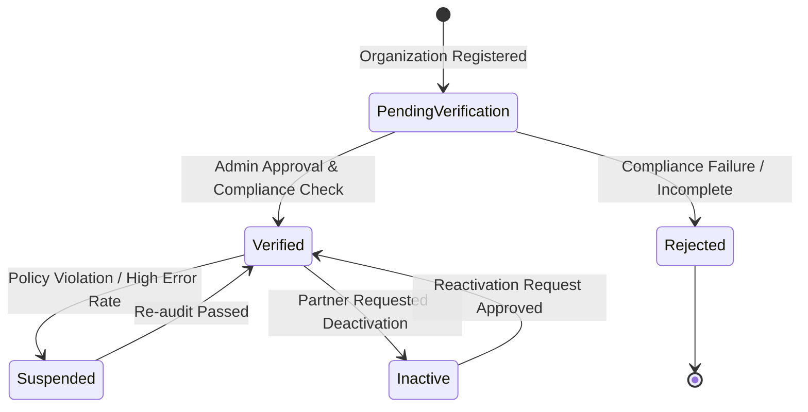
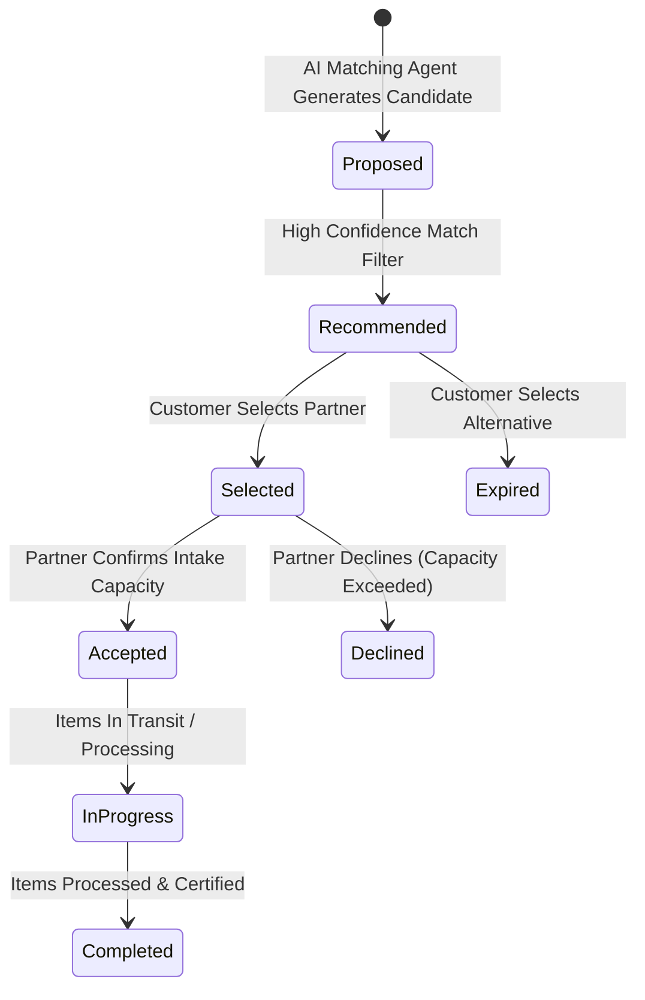

# Partner Status Lifecycle & State Transitions

## 1. Partner Organization Status Lifecycle

### Partner Statuses:
- **`PendingVerification`**: Initial state after organization sign-up. Cannot receive item matches.
- **`Verified`**: Fully approved partner active on the directory, eligible for AI matching and dispatch.
- **`Suspended`**: Temporarily barred from receiving new assignments due to compliance or SLA issues.
- **`Inactive`**: Dormant or seasonally paused partner account.
- **`Rejected`**: Registration declined by platform administration.

---

## 2. Partner Match & Selection Lifecycle

### Match States:
- **`Proposed`**: Candidate scored by `PartnerMatchingAgent`.
- **`Recommended`**: Ranked in top recommendations shown to customer.
- **`Selected`**: Chosen by customer for pickup or drop-off fulfillment.
- **`Accepted`**: Partner accepted the assignment into their processing queue.
- **`Completed`**: Partner marked recovery/recycling processing as finished.
