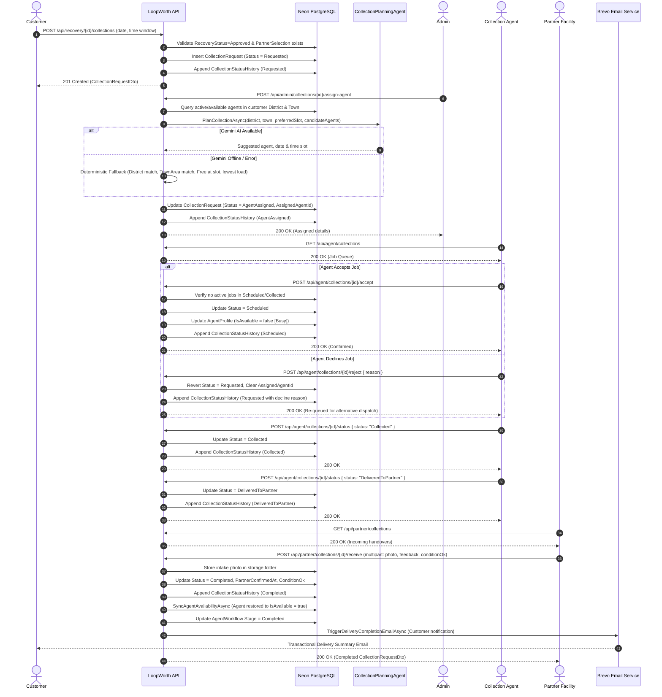

# Collections Sequence Flow

## Overview

This document illustrates the sequential interaction flow of the Collections subsystem in LoopWorth, tracing a customer's electronic waste pickup from initial scheduling through AI-assisted dispatch, agent acceptance, physical collection, partner facility intake, and final automated notification.

---

## Main Flow Sequence Diagram

---

## Detailed Sequence Phases

### 1. Customer Interaction
1. **Initiation**: The customer navigates to the scheduling interface (`/recovery/:id/schedule`) after receiving approval for their recovery item and having an assigned partner facility.
2. **Preference Specification**: The customer inputs their preferred pickup date and morning or afternoon time window (e.g., 09:00:00 to 12:00:00).
3. **Submission**: The web app sends `POST /api/recovery/{id}/collections`. The API verifies that:
   - The recovery request exists and has `RecoveryStatus.Approved`.
   - A `PartnerSelection` entity exists linking the item to a processing partner.
   - The caller is authorized.
4. **Outcome**: The request is created in `CollectionStatus.Requested` with an initial audit entry.

---

### 2. Collection Planning Agent & Intelligent Dispatch
1. **Dispatch Trigger**: An Administrator initiates dispatch via `POST /api/admin/collections/{id}/assign-agent` (or customer via `/plan`).
2. **Candidate Filtering**:
   - Locates customer district and town from customer profile.
   - Filters active collection agent profiles (`IsActive == true`).
   - Identifies candidate agents currently marked available (`IsAvailable == true`).
   - Excludes any agents who previously declined this specific collection request.
   - Scans other scheduled jobs across candidate agents to detect calendar time conflicts.
3. **AI Recommendation**:
   - `CollectionPlanningAgent` prompts Gemini with customer location, requested slot, partner operating hours, and candidate profiles with conflict flags.
   - Guardrail: The AI response is parsed and validated. If the suggested agent ID is not in the candidate pool, the fallback selection executes.
4. **Deterministic Fallback**:
   - If AI fails or returns an invalid candidate, candidates in the customer's district are ordered by slot availability, town substring match (`c.TownArea.Contains(customerTown)`), and active job count.
5. **Outcome**: Order updates to `CollectionStatus.AgentAssigned`.

---

### 3. Admin Dispatch Controls
1. **Queue Inspection**: Administrator monitors the queue via `GET /api/admin/collections?status=Requested`.
2. **Automated or Manual Allocation**:
   - Admin can trigger the AI dispatch endpoint (`/assign-agent`).
   - Alternatively, Admin can manually select an agent and specific window via `POST /api/admin/collections/{id}/assign`.
3. **Lock Protection**: Reassignment is strictly blocked once an agent accepts and confirms the appointment (`Scheduled`).

---

### 4. Collection Agent Actions
1. **Queue Review**: Assigned agent queries `GET /api/agent/collections`.
2. **Job Acceptance**:
   - Agent calls `POST /api/agent/collections/{id}/accept`.
   - The API verifies that the agent has no other concurrent active jobs in `Scheduled` or `Collected`.
   - Order transitions to `CollectionStatus.Scheduled`.
   - Agent profile availability switches to Busy (`IsAvailable = false`).
3. **Job Rejection**:
   - If unable to fulfill the request, agent calls `POST /api/agent/collections/{id}/reject` with a reason.
   - Order reverts to `Requested`, and the declining agent is recorded in history and excluded from immediate re-dispatch.

---

### 5. Partner Handover & Facility Intake
1. **Doorstep Pickup**: On the scheduled date, the agent arrives at the customer's address, receives the e-waste, and updates status to `Collected` via `POST /api/agent/collections/{id}/status`.
2. **Transport & Delivery**: The agent transports the package to the partner facility and calls `POST /api/agent/collections/{id}/status` with `DeliveredToPartner`.
3. **Facility Intake Inspection**:
   - Partner staff inspects incoming deliveries via `GET /api/partner/collections`.
   - Partner confirms intake at `POST /api/partner/collections/{id}/receive`, uploading an intake photograph, noting physical condition (`ConditionOk`), and adding remarks.

---

### 6. Completion & Notification
1. **Final State**: Status advances to `CollectionStatus.Completed`.
2. **Resource Synchronization**:
   - The assigned agent's active workload count decreases; if no active jobs remain, the profile is reset to `IsAvailable = true`.
   - Linked `AgentWorkflow` updates to `CurrentStage = "Completed"`.
3. **Customer Notification**:
   - The system calls `TriggerDeliveryCompletionEmailAsync`.
   - `DeliveryNotificationAgent` formats a completion summary including item specifications, partner verification details, and condition results.
   - Brevo dispatches the transactional email to the customer.
